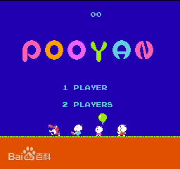
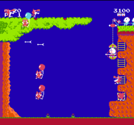

# Pooyan
A game written by QT Pooyan（https://en.wikipedia.org/wiki/Pooyan)
中文：[猪小弟](https://baike.baidu.com/item/%E7%8C%AA%E5%B0%8F%E5%BC%9F/416835?fr=aladdin)

like:

these images are from Baidu baike.

This is a job for my c++ class last term.
 
Unfortunately, the project completed only one and a half days, and QT's learning was only three days, so the content is very rough. Upload the code to Github to save it and urge myself to re-complete it.
